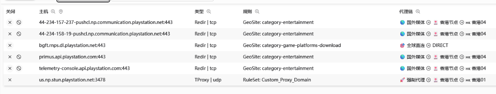
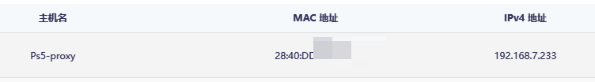

# OpenClash 配置教程

> **提示**：谷歌 FCM 是推送服务，谷歌服务 → 谷歌服务。

---

## 更新日志
### 2026-3-24
PS5设置DHCP时nat类型失败原因为获取时走了不同的规则



此时如果想设置DHCP并NAT类型成功,则可以绑定MAC地址与IP

走DHCP时自动获取绑定的IP地址



搭配openclash-覆写-规则设置内,指定该IP全部走一个节点组

      SRC-IP-CIDR,192.168.7.233/32,🌐 PS & NS2

### 2026-2-6
在AGH配置ps5绕过AGH即可,此时ps5nat类型稳定测试为2,并且上传下载速度都正常

**最好配置设备的MAC地址**


### 2026-1-22
在防火墙`打开硬件流量卸载`,网络环境更好,mt6000支持硬件流量卸载

---

### 2025-08-08

更新了 Smart 内核，目前收集数据中，等待训练成自己的模型。

---

### 2025-04-15（上）

在覆写设置-DNS 设置-Fake-IP-Filter-Mode 里面把以下域名加入到域名列表：

- `*.playstation.net`
- `*.stun.playstation.net`
- `*.sonyentertainmentnetwork.com`
- `*.sony.com`

---

## 提示

### 网络-DHCP/DNS-静态地址分配

配置主机名和 MAC 地址绑定：


### 软件包替换源

将源地址：`https://downloads.immortalwrt.org`

修改为：

```
https://mirrors.cernet.edu.cn/immortalwrt
```

---

## ImmortalWrt 关闭 IPv6

### LAN 口

**网络-接口**：删除 wan6 接口，编辑 br-lan 接口：


**DHCP 服务器-IPv6 设置**：禁用三个 IPv6 服务，不勾选指定的主接口：


**全局网络选项**删除 IPv6 地址：


**网络-DHCP/DNS-过滤器**：勾选过滤 IPv6 AAAA 记录：


以上操作之后设备禁用 IPv6 地址。

### WAN 口

> **重要**：br-lan 的网段不可以和 WAN 的网段相同。

接口配置 WAN 口禁用获取 IPv6 地址：


---

## OpenClash 插件设置

### 插件-模式设置

新版本默认只有 Meta 内核，使用 FakeIP 增强模式就行。

勾选 UDP 流量转发。

代理模式 Rule：


### 插件-流量控制

勾选路由本机代理、禁用 QUIC、绕过服务器地址、实验性绕过中国大陆 IP（配置延迟低的 DNS）、仅允许内网。

LAN 接口配置为 `br-lan`。


### 插件-DNS 设置

使用 Dnsmasq 进行转发。

清理一下持久化缓存，勾选禁止 Dnsmasq 缓存 DNS。


### 插件-流媒体增强

忽略。

### 插件-黑白名单（覆写设置-规则设置）

- `SRC-IP-CIDR,192.168.7.233/32,DIRECT` - 意为 7.233 IP 设备走直连

- `SRC-IP-CIDR,192.168.7.233/32,节点分组名` - 意为 7.233 IP 设备走指定节点分组。例如：`SRC-IP-CIDR,192.168.7.233/32,🚀 手动切换`

经测试发现黑白名单和自定义规则都可以实现不走代理。

区别在于黑白名单只能定义 IP。

自定义规则可以定义域名：

- `DOMAIN-SUFFIX,google.com,（代理组名）` - 匹配域名后缀，意为 `xxx.google.com` 走代理
- `DOMAIN-KEYWORD,google,DIRECT（代理组名）` - 匹配域名关键字，意为域名含有 google 的走 DIRECT
- `DOMAIN,google.com,DIRECT（代理组名）` - 匹配域名，意为全域名匹配成功的走 DIRECT


### 插件-外部控制

忽略。

### 插件-IPv6 设置

取消勾选，不使用 IPv6。


### 插件-GEO 数据库订阅

可以使用默认链接。

> **重要**：每天或每周更新一次，设置完自定义 URL 后点击检查并更新进行更新，单纯点击保存配置没有用。


### 插件-大陆白名单订阅

勾选自动更新，其余默认即可。


---

## OpenClash 覆写设置

### 覆写-常规设置

> **重要**：如果更新订阅出现【tmp/yaml_sub_tmp_config.yaml】下载失败等无法连接 GitHub 错误。

在覆写设置-Github 地址修改中自定义 GitHub 的解析地址：


### 覆写-DNS 设置

勾选 Fake-IP 持久化，Fake-IP-Filter。

勾选自定义上游服务器。

在 AdGuard 配置好后（参考 new_adguardhome_config）。

下方 nameserver 输入 `127.0.0.1:5335` UDP+TCP。


### 覆写-Meta 设置

勾选启用 TCP 并发、启用统一延迟（为了测速好看，可开可不开）、Fake-IP 持久化、启用流量（域名）探测、探测（嗅探）纯 IP 连接。

其余停用或不勾选。


### 覆写-规则设置

参考上方黑白名单。


### 覆写-开发者选项

> **注意**：新版本没有配置项，可忽略。

---

## OpenClash 规则附加

按如图配置即可，更新 push 后过几分钟更新规则即可生效，避免重启服务，链接如下：


---

## OpenClash 配置订阅

> **重要**：漏网之鱼不能选全球直连！会泄露 DNS。此时在绕过大陆 IP 选项的作用下，国内 IP 不会走 Clash 内核。

测试 DNS 泄露网址：https://browserleaks.com/dns

### 勾选自动更新，修改配置文件

勾选在线订阅转换，订阅转换服务地址 clash-meta，订阅转换模板为自定义模板。

参考：[一个链接同时实现配置模板和后端订阅转换](/TutorialFiles_yx/一个链接同时实现配置模板和后端订阅转换.md)

添加 Emoji 可开，UDP 启用，规则集启用，增加节点类型可开可不开。

---

## 下一步配置

[下一步配置 AdGuardHome 在这里](/AdGuardHome_yx/New_ADGuardHome_config.md)